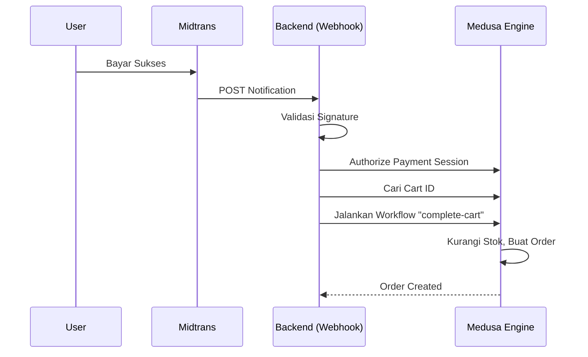

# Midtrans Integration Safety & Architecture

## Overview

Integrasi Midtrans ini menggunakan pendekatan hybrid yang menggabungkan **Medusa Commerce Engine** yang kuat dengan **Custom Driver** untuk menjembatani logika spesifik pembayaran Indonesia (Midtrans).

## Referensi Implementasi

- **Webhook Handler**: `src/api/webhooks/midtrans/route.ts`
- **Payment Provider**: `src/modules/payment-midtrans/service.ts`
- **Reconciliation Job**: `src/jobs/reconcile-payments.ts`
- **Workflow**: `src/workflows/initiate-midtrans-payment.ts`

## 1. Arsitektur: Medusa Engine + Custom Driver

### Medusa (The Engine)

Kita TIDAK membangun ulang logika e-commerce dari nol. Medusa menangani hal-hal kompleks berikut secara native:

- **Workflow `complete-cart`**: Validasi stok, kalkulasi pajak, pembuatan order, dan pembersihan keranjang.
- **DB Transaction**: Jaminan data konsisten (ACID). Jika order gagal dibuat, database di-rollback ke state bersih.
- **Provider Interface**: Struktur standar untuk `authorize`, `capture`, `refund`.

### Custom Driver (The Bridge)

Kode kustom yang kita bangun bertindak sebagai "sopir" untuk mengendalikan engine Medusa berdasarkan sinyal dari Midtrans:

- **Translation**: Menerjemahkan webhook Midtrans (`settlement`, `fraud_status`) menjadi aksi Medusa.
- **Automation**: Memicu penyelesaian order otomatis dari sisi server (Server-Side Completion).
- **Intelligence**: Menambahkan logika kompensasi otomatis jika terjadi kegagalan.

## 2. Server-Side Order Completion

Masalah umum pada Payment Gateway adalah "Drop-off": User membayar sukses, tapi menutup browser sebelum redirect kembali ke website. Akibatnya, uang masuk tapi Order tidak terbuat.

**Solusi Kami:**
Di dalam Webhook Handler (`route.ts`), kita mendeteksi sinyal sukses (`settlement`/`capture`) dan **secara proaktif** mencari Keranjang (Cart) terkait dan memanggil workflow `complete-cart` Medusa.

## 3. Transaction Safety & Compensation (Rollback)

Meskipun jarang, pembuatan Order bisa gagal (misal: stok habis tepat saat detik pembayaran). Jika ini terjadi tanpa penanganan, user akan kehilangan uang tanpa mendapatkan barang ("Paid but No Order").

**Mekanisme Kompensasi Otomatis:**
Kami mengimplementasikan blok `try-catch` cerdas di webhook handler:

1. **Deteksi Error**: Jika workflow `complete-cart` melempar error.
2. **Analisis Status**:
    - Jika pembayaran **Pending** (misal Bank Transfer belum lunas tapi error sistem terjadi): Sistem melakukan **Cancel**.
    - Jika pembayaran **Settlement** (Uang sudah masuk): Sistem melakukan **Refund Otomatis**.
3. **Logging**: Jika kompensasi otomatis gagal (sangat jarang), dicatat sebagai `CRITICAL` log untuk intervensi manual Admin.

## 4. Enhanced Resilience Strategy (New Updates)

Berikut adalah skenario kegagalan spesifik yang kini sudah ditangani secara otomatis:

### A. Webhook Failure (Jaringan / Server Error)

* **Masalah**: Webhook dari Midtrans gagal sampai karena koneksi putus atau server maintenance (502).
- **Solusi (Preventif)**: Endpoint Webhook kita kini mengembalikan **HTTP 500** jika terjadi error internal. Ini memaksa Midtrans untuk **mengirim ulang (Retry)** notifikasi secara berkala (mekanisme bawaan Midtrans).
- **Solusi (Kuratif)**: Jika Webhook tetap gagal total, **Reconciliation Job** akan "menjemput bola" setiap 1 jam untuk mengecek status pembayaran yang menggantung dan menyelesaikannya.

### B. Orphan Payments (Bayar tapi Tidak Ada Order)

* **Masalah**: Kasus langka dimana webhook tidak terproses sama sekali.
- **Solusi**: Job `reconcile-payments.ts` berjalan setiap jam.
    1. Mencari sesi pembayaran `pending` > 5 menit yang lalu.
    2. Cek status ke Midtrans API.
    3. Jika status Midtrans `settlement`, job otomatis membuatkan Order (Replay Logic).

### C. Flash Sale Overselling (Stok Berebut)

* **Masalah**: Stok tinggal 1, tapi 100 orang klik "Pay" bersamaan. Siapa cepat dia dapat?
- **Solusi**:
  - **Inventory Reservation**: Saat user klik tombol "Pay" (sebelum bayar), stok langsung **dikunci** (reserved) selama 15 menit.
  - User ke-2 dst akan mendapat error "Out of Stock" saat mencoba mengambil token pembayaran.
  - Jika User ke-1 batal bayar, reservasi hangus otomatis setelah 15 menit.
  - **Conflict Resolution**: Webhook dan Reconciliation Job dikonfigurasi untuk melepas reservasi sementara ini sesaat sebelum membuat Order permanen, mencegah error "Double Reservation".

## 5. Troubleshooting & Tips Integrasi

1. **Log Error Query**: Bungkus logika query dalam search try-catch terpisah agar jika pencarian data gagal, kita bisa tahu persis dan tidak hanya "silent fail".
2. **Verifikasi Transaction Status**: Pastikan hanya memproses status `settlement` dan `capture` untuk pembuatan order. Status `pending` tidak boleh membuat order.
3. **Jangan Ubah Cart ID**: Midtrans butuh ID yang konsisten. Jangan membuat cart baru di tengah sesi pembayaran.
