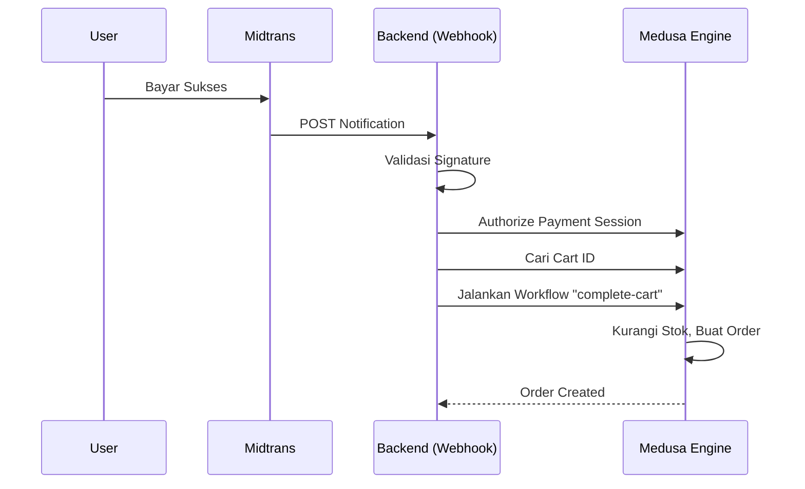

# Midtrans Integration Safety & Architecture

## Overview

Integrasi Midtrans ini menggunakan pendekatan hybrid yang menggabungkan **Medusa Commerce Engine** yang kuat dengan **Custom Driver** untuk menjembatani logika spesifik pembayaran Indonesia (Midtrans).

## Referensi Implementasi

- **Webhook Handler**: `src/api/webhooks/midtrans/route.ts`
- **Payment Provider**: `src/modules/payment-midtrans/service.ts`

## 1. Arsitektur: Medusa Engine + Custom Driver

### Medusa (The Engine)

Kita TIDAK membangun ulang logika e-commerce dari nol. Medusa menangani hal-hal kompleks berikut secara native:

- **Workflow `complete-cart`**: Validasi stok, kalkulasi pajak, pembuatan order, dan pembersihan keranjang.
- **DB Transaction**: Jaminan data konsisten (ACID). Jika order gagal dibuat, database di-rollback ke state bersih.
- **Provider Interface**: Struktur standar untuk `authorize`, `capture`, `refund`.

### Custom Driver (The Bridge)

Kode kustom yang kita bangun bertindak sebagai "sopir" untuk mengendalikan engine Medusa berdasarkan sinyal dari Midtrans:

- **Translation**: Menerjemahkan webhook Midtrans (`settlement`, `fraud_status`) menjadi aksi Medusa.
- **Automation**: Memicu penyelesaian order otomatis dari sisi server (Server-Side Completion).
- **Intelligence**: Menambahkan logika kompensasi otomatis jika terjadi kegagalan.

## 2. Server-Side Order Completion

Masalah umum pada Payment Gateway adalah "Drop-off": User membayar sukses, tapi menutup browser sebelum redirect kembali ke website. Akibatnya, uang masuk tapi Order tidak terbuat.

**Solusi Kami:**
Di dalam Webhook Handler (`route.ts`), kita mendeteksi sinyal sukses (`settlement`/`capture`) dan **secara proaktif** mencari Keranjang (Cart) terkait dan memanggil workflow `complete-cart` Medusa.



## 3. Transaction Safety & Compensation (Rollback)

Meskipun jarang, pembuatan Order bisa gagal (misal: stok habis tepat saat detik pembayaran). Jika ini terjadi tanpa penanganan, user akan kehilangan uang tanpa mendapatkan barang ("Paid but No Order").

**Mekanisme Kompensasi Otomatis:**
Kami mengimplementasikan blok `try-catch` cerdas di webhook handler:

1. **Deteksi Error**: Jika workflow `complete-cart` melempar error.
2. **Analisis Status**:
    - Jika pembayaran **Pending** (misal Bank Transfer belum lunas tapi error sistem terjadi): Sistem melakukan **Cancel**.
    - Jika pembayaran **Settlement** (Uang sudah masuk): Sistem melakukan **Refund Otomatis**.
3. **Logging**: Jika kompensasi otomatis gagal (sangat jarang), dicatat sebagai `CRITICAL` log untuk intervensi manual Admin.

```typescript
try {
    // Coba buat Order
    await workflowEngine.run("complete-cart", { input: { id: cart.id } })
} catch (error) {
    // JIKA GAGAL -> KEMBALIKAN UANG
    logger.error("Order creation failed, rolling back payment...")
    await paymentModule.cancelPaymentSession(orderId) // Memicu Refund/Cancel di Midtrans
}
```

Implementasi ini menjamin **Zero Data Inconsistency** dan pengalaman pengguna yang aman.

## 4. Troubleshooting & Pelajaran Penting (Lessons Learned)

Bagian ini mendokumentasikan masalah nyata yang dihadapi selama pengembangan dan solusinya, agar tidak terulang di masa depan.

### Masalah: "Paid but No Order" (Bayar Sukses, Order Tidak Ada)

**Gejala:**

- Transaksi di Midtrans berstatus `Success`/`Settlement`.
- Webhook masuk dengan status `200 OK`.
- Tapi Order tidak terbentuk di Medusa.
- Mekanisme Refund Otomatis TIDAK berjalan.

**Penyebab (Root Cause):**
Kesalahan cara query database (Relational Query). Kode mencoba mengakses `payment_collection_id` langsung dari entity `Cart`, padahal di versi Medusa ini, link tersebut ada di entity `PaymentCollection`.

```typescript
// Query yang GAGAL (Penyebab Error)
filters: { payment_collection_id: "pay_col_123" } 
// Error: Trying to query by not existing property Cart.payment_collection_id
```

Karena query ini gagal (Throw Error) **SEBELUM** masuk blok `try-catch` pembuatan order, maka:

1. Pembuatan Order tidak pernah dicoba.
2. Logika Refund tidak pernah dipicu.

**Solusi (Fix):**
Gunakan query bertahap yang mengikuti relasi data yang benar:

1. Query `payment_collection` berdasarkan ID.
2. Minta relasi `cart.id` secara eksplisit (`fields: ["cart.id"]`).
3. Gunakan `cart.id` tersebut untuk mencari Cart.

```typescript
// Query yang BENAR
const { data: [paymentCollection] } = await query.graph({
    entity: "payment_collection",
    fields: ["cart.id"], // Akses Relasi
    filters: { id: paymentCollectionId }
})
const cartId = paymentCollection.cart.id // Aman
```

### Tips Keamanan Integrasi

1. **Jangan berasumsi struktur data**: Selalu cek definisi entity Medusa atau gunakan `query.graph` dengan relasi eksplisit.
2. **Log Error Query**: Bungkus logika query dalam search try-catch terpisah agar jika pencarian data gagal, kita bisa tahu persis (seperti masalah di atas) dan tidak hanya "silent fail".
3. **Verifikasi Transaction Status**: Pastikan hanya memproses status `settlement` dan `capture` untuk pembuatan order. Status `pending` tidak boleh membuat order.
