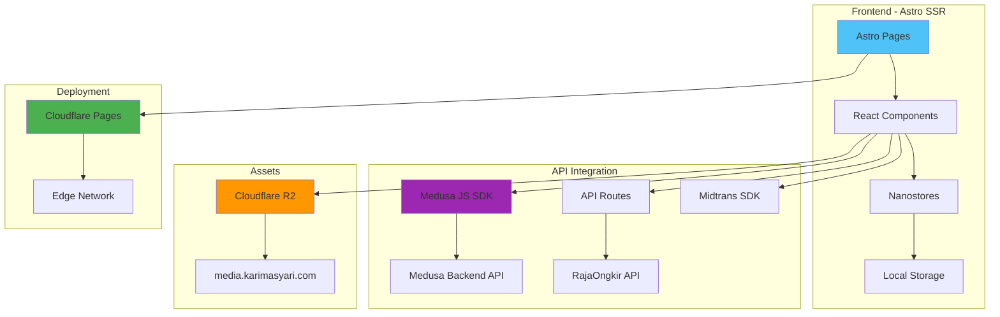
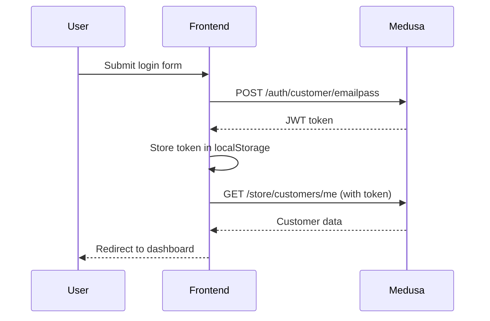
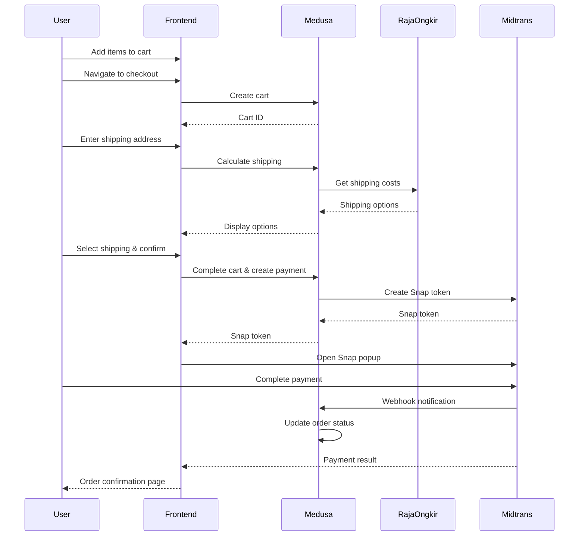

# Mastro Store - Storefront Skeleton

## 📋 Overview

**Mastro Store Storefront** adalah aplikasi e-commerce frontend yang dibangun dengan **Astro + React**, terintegrasi dengan **Medusa v2** sebagai backend headless commerce. Storefront ini menggunakan **Server-Side Rendering (SSR)** dan di-deploy pada **Cloudflare Pages**.

### Tech Stack

| Layer | Technology | Purpose |
|-------|-----------|---------|
| **Framework** | Astro 5.x | SSR, routing, dan page rendering |
| **UI Library** | React 19.x | Interactive components |
| **Styling** | Tailwind CSS 4.x | Utility-first CSS framework |
| **State Management** | Nanostores | Lightweight reactive store (cart, wishlist) |
| **Backend SDK** | @medusajs/js-sdk | Medusa backend integration |
| **Payment Gateway** | Midtrans | Payment processing |
| **Shipping API** | RajaOngkir | Shipping cost calculation |
| **Asset Storage** | Cloudflare R2 | Static assets (images, media) |
| **Deployment** | Cloudflare Pages | Edge hosting & CDN |
| **Testing** | Vitest + Testing Library | Unit & integration tests |

---

## 🏗️ Architecture Overview



---

## 📁 Directory Structure

```
storefront/
├── .astro/                      # Astro build cache
├── .vscode/                     # VS Code settings
├── .wrangler/                   # Wrangler (Cloudflare) cache
├── _assets_workflow/            # Asset upload scripts (R2)
│   └── upload.js               # Bulk asset uploader
│
├── dist/                        # Production build output
├── docs/                        # Documentation
├── node_modules/
├── public/                      # Static assets (fallback)
│   ├── favicon.svg
│   └── ...                     # Public assets
│
├── refrensi-website/           # Design reference
├── scripts/                     # Build & utility scripts
│
├── src/
│   ├── components/             # React & Astro Components
│   │   ├── account/           # Account-related components
│   │   │   ├── AccountLayout.tsx
│   │   │   ├── Dashboard.tsx
│   │   │   ├── Login.tsx
│   │   │   └── Register.tsx
│   │   ├── AddressSelector.tsx
│   │   ├── CartPage.tsx
│   │   ├── CartSummary.tsx
│   │   ├── CheckoutForm.tsx
│   │   ├── ContactForm.tsx
│   │   ├── FaqList.tsx
│   │   ├── FeaturesBar.astro
│   │   ├── FilterSidebar.tsx
│   │   ├── Footer.astro
│   │   ├── Hero.tsx
│   │   ├── Marquee.astro
│   │   ├── Navbar.tsx
│   │   ├── OrderConfirmation.tsx
│   │   ├── ProductCard.tsx
│   │   ├── ProductDetail.tsx
│   │   ├── ProductDetailClient.tsx
│   │   ├── ProductReviews.tsx
│   │   ├── RelatedProducts.tsx
│   │   ├── SectionHeader.astro
│   │   ├── ShopContainer.tsx
│   │   ├── SizeGuideModal.tsx
│   │   └── Wishlist.tsx
│   │
│   ├── content/                # Content Collections
│   │   └── config.ts
│   │
│   ├── data/                   # Static data (if any)
│   │
│   ├── hooks/                  # React Custom Hooks
│   │   └── ...
│   │
│   ├── layouts/                # Astro Layouts
│   │   └── Layout.astro       # Base layout
│   │
│   ├── lib/                    # Core libraries
│   │   ├── __tests__/
│   │   │   ├── cart.test.ts
│   │   │   └── medusa.test.ts
│   │   ├── cart.ts            # Cart utilities
│   │   ├── data.ts            # Data helpers
│   │   └── medusa.ts          # Medusa SDK wrapper
│   │
│   ├── pages/                  # Astro Pages (File-based routing)
│   │   ├── api/               # API Routes
│   │   │   └── shipping/
│   │   │       └── calculate.ts  # RajaOngkir proxy
│   │   ├── blog/              # Blog pages
│   │   ├── order/             # Order pages
│   │   ├── product/           # Product detail pages
│   │   ├── products/          # Product listing pages
│   │   ├── about.astro
│   │   ├── account.astro
│   │   ├── cart.astro
│   │   ├── checkout.astro
│   │   ├── contact.astro
│   │   ├── faq.astro
│   │   ├── index.astro        # Homepage
│   │   ├── returns.astro
│   │   ├── shipping.astro
│   │   ├── shop.astro
│   │   └── wishlist.astro
│   │
│   ├── store/                  # Nanostores
│   │   ├── cart.ts            # Cart state
│   │   └── wishlist.ts        # Wishlist state
│   │
│   ├── styles/                 # Global styles
│   │   └── global.css
│   │
│   ├── test/                   # Test setup
│   │   └── setup.ts
│   │
│   ├── types/                  # TypeScript types
│   │   └── index.ts
│   │
│   ├── utils/                  # Utility functions
│   │
│   └── constants.ts            # App constants
│
├── .dockerignore
├── .env                        # Environment variables
├── .env.production.template    # Production env template
├── .gitignore
├── astro.config.mjs            # Astro configuration
├── Dockerfile                  # Docker build
├── package.json
├── package-lock.json
├── README.md
├── tsconfig.json               # TypeScript config
├── vitest.config.ts            # Vitest config
└── wrangler.toml               # Cloudflare Pages config
```

---

## 🎯 Key Features

### 1. **Product Catalog**

- **Product Listing** (`/shop.astro`, `/products/*`)
  - Grid/list view toggle
  - Filtering by category, price, size, color
  - Sorting options
  - Pagination
- **Product Detail** (`/product/[handle].astro`)
  - Image gallery with thumbnails & zoom
  - Variant selection (color, size)
  - Add to cart/wishlist
  - Related products
  - Product reviews

### 2. **Shopping Cart** (Nanostores)

- **Cart State Management** (`src/store/cart.ts`)
  - Persistent cart (LocalStorage)
  - Add/remove/update items
  - Quantity management
  - Real-time subtotal calculation
- **Cart Page** (`/cart.astro`)
  - Item listing with thumbnails
  - Quantity adjustment
  - Apply coupon codes
  - Proceed to checkout

### 3. **Checkout Flow**

- **Checkout Page** (`/checkout.astro`)
  - Customer information form
  - Address selector/input
  - Shipping method selection (RajaOngkir integration)
  - Payment gateway (Midtrans)
  - Order summary
- **Order Confirmation** (`/order/confirmation.astro`)
  - Order details
  - Payment status
  - Tracking information

### 4. **User Account**

- **Authentication** (`/account.astro`)
  - Login/Register (Medusa customer accounts)
  - JWT-based session
- **Dashboard** (`src/components/account/Dashboard.tsx`)
  - Order history
  - Profile management
  - Saved addresses
  - Password change

### 5. **Wishlist** (Nanostores)

- **Wishlist State** (`src/store/wishlist.ts`)
  - Persistent wishlist (LocalStorage)
  - Add/remove products
  - Move to cart
- **Wishlist Page** (`/wishlist.astro`)

### 6. **Content Pages**

- **About** (`/about.astro`)
- **Contact** (`/contact.astro`) - with contact form
- **FAQ** (`/faq.astro`)
- **Shipping Info** (`/shipping.astro`)
- **Returns Policy** (`/returns.astro`)
- **Blog** (`/blog/*`) - optional content marketing

---

## 🔌 Integration Points

### 1. **Medusa Backend Integration**

**File**: `src/lib/medusa.ts`

```typescript
// Wrapper untuk Medusa JS SDK
import Medusa from "@medusajs/js-sdk"

export const medusa = new Medusa({
  baseUrl: import.meta.env.PUBLIC_MEDUSA_BACKEND_URL,
  publishableKey: import.meta.env.PUBLIC_MEDUSA_PUBLISHABLE_KEY,
})

// Example: Fetch products
export async function getProducts(params?) {
  const { products } = await medusa.store.product.list(params)
  return products
}
```

**Key Functions**:

- `getProducts()` - Fetch product listing
- `getProductByHandle()` - Fetch single product
- `createCart()` - Initialize cart
- `addLineItem()` - Add item to cart
- `completeCart()` - Finalize order
- `login()` / `register()` - Customer authentication

### 2. **RajaOngkir Shipping API**

**File**: `src/pages/api/shipping/calculate.ts`

**Flow**:

1. User enters destination address
2. Frontend calls `/api/shipping/calculate`
3. API route proxies request to Medusa backend
4. Backend calls RajaOngkir API
5. Returns available shipping options with costs

**Response Format**:

```json
{
  "shipping_options": [
    {
      "id": "so_jne_reg",
      "name": "JNE REG",
      "amount": 15000,
      "estimated_days": "2-3"
    }
  ]
}
```

### 3. **Midtrans Payment Gateway**

**Flow**:

1. User completes checkout form
2. Frontend creates Snap token via Medusa backend
3. Midtrans Snap popup opens
4. User completes payment
5. Midtrans sends webhook to backend
6. Backend updates order status
7. Frontend redirects to order confirmation

**Implementation**:

```typescript
// Load Midtrans Snap script
const script = document.createElement('script')
script.src = import.meta.env.PUBLIC_MIDTRANS_URL
script.setAttribute('data-client-key', import.meta.env.PUBLIC_MIDTRANS_CLIENT_KEY)
document.body.appendChild(script)

// Trigger payment
window.snap.pay(snapToken, {
  onSuccess: (result) => { /* redirect to confirmation */ },
  onPending: (result) => { /* show pending status */ },
  onError: (result) => { /* show error */ },
  onClose: () => { /* handle modal close */ }
})
```

### 4. **Cloudflare R2 Asset Storage**

**CDN URL**: `https://media.karimasyari.com`

**Usage**:

```typescript
// In components
const imageUrl = `${import.meta.env.PUBLIC_ASSET_URL}/products/product-123.webp`
```

**Asset Upload**:

```bash
npm run upload:assets
```

Uses `_assets_workflow/upload.js` to bulk upload assets to R2.

---

## 🛠️ Development Workflow

### Setup

```bash
# Install dependencies
npm install

# Configure environment
cp .env.production.template .env
# Edit .env with your credentials

# Start dev server
npm run dev
# Runs on http://localhost:4321
```

### Environment Variables

**Required**:

- `PUBLIC_MEDUSA_BACKEND_URL` - Medusa API endpoint
- `PUBLIC_MEDUSA_PUBLISHABLE_KEY` - Medusa publishable key
- `PUBLIC_MIDTRANS_CLIENT_KEY` - Midtrans client key
- `PUBLIC_MIDTRANS_URL` - Midtrans Snap script URL
- `PUBLIC_RAJAONGKIR_ORIGIN_CITY_ID` - Origin city for shipping
- `PUBLIC_ASSET_URL` - CDN URL for assets

**Optional**:

- `R2_*` - Cloudflare R2 credentials (for asset upload)

### Build & Deploy

```bash
# Production build
npm run build

# Preview build locally
npm run preview

# Deploy to Cloudflare Pages
npm run deploy
```

### Testing

```bash
# Run tests
npm run test

# Run tests in watch mode
npm run test:watch

# Run tests once (CI)
npm run test:run
```

---

## 🎨 Design System

### Tailwind Configuration

**File**: Uses `@tailwindcss/vite` plugin

**Key Design Tokens**:

- **Colors**: Defined in Tailwind config or inline
- **Typography**: Tailwind default + custom font imports
- **Spacing**: Tailwind default scale
- **Breakpoints**: `sm`, `md`, `lg`, `xl`, `2xl`

### Component Patterns

1. **Astro Components** (`.astro`)
   - For static/SSR content
   - Layout components (Header, Footer)
   - Page wrappers

2. **React Components** (`.tsx`)
   - For interactive elements
   - Client-side state management
   - Form handling

**Example**:

```astro
---
// page.astro (SSR)
import ProductCard from '../components/ProductCard.tsx'
const products = await getProducts()
---

<div>
  {products.map(product => (
    <ProductCard product={product} client:load />
  ))}
</div>
```

---

## 🔐 Authentication Flow

### Customer Authentication



**Key Files**:

- `src/components/account/Login.tsx` - Login form
- `src/components/account/Register.tsx` - Registration form
- `src/lib/medusa.ts` - Auth helper functions

---

## 🛒 Cart & Checkout Flow

### Cart State Management (Nanostores)

**File**: `src/store/cart.ts`

```typescript
import { atom } from 'nanostores'
import { persistentAtom } from '@nanostores/persistent'

export const cartStore = persistentAtom('cart', [], {
  encode: JSON.stringify,
  decode: JSON.parse,
})

export function addToCart(item) {
  cartStore.set([...cartStore.get(), item])
}

export function removeFromCart(itemId) {
  cartStore.set(cartStore.get().filter(i => i.id !== itemId))
}
```

### Checkout Process



---

## 📦 Data Flow Patterns

### SSR Product Listing

```astro
---
// src/pages/shop.astro
import { medusa } from '../lib/medusa'
import ShopContainer from '../components/ShopContainer.tsx'

const { products, count } = await medusa.store.product.list({
  limit: 20,
  offset: 0,
})
---

<ShopContainer products={products} count={count} client:load />
```

### Client-Side Cart Interaction

```tsx
// src/components/ProductDetail.tsx
import { useStore } from '@nanostores/react'
import { cartStore, addToCart } from '../store/cart'

export default function ProductDetail({ product }) {
  const cart = useStore(cartStore)
  
  const handleAddToCart = () => {
    addToCart({
      id: product.id,
      title: product.title,
      variant_id: selectedVariant.id,
      quantity: 1,
      price: selectedVariant.prices[0].amount,
    })
  }
  
  return (
    <button onClick={handleAddToCart}>
      Add to Cart
    </button>
  )
}
```

---

## 🚀 Deployment (Cloudflare Pages)

### Configuration

**File**: `wrangler.toml`

```toml
name = "mastro-store-storefront"
compatibility_date = "2024-01-01"

[site]
bucket = "./dist"
```

### Build Settings (Cloudflare Dashboard)

- **Framework preset**: Astro
- **Build command**: `npm run build`
- **Build output**: `dist`
- **Node version**: 20.x

### Environment Variables (Production)

Set in Cloudflare Pages dashboard:

- `PUBLIC_MEDUSA_BACKEND_URL`
- `PUBLIC_MEDUSA_PUBLISHABLE_KEY`
- `PUBLIC_MIDTRANS_CLIENT_KEY`
- `PUBLIC_MIDTRANS_URL`
- `PUBLIC_MIDTRANS_IS_PRODUCTION=true`
- `PUBLIC_RAJAONGKIR_ORIGIN_CITY_ID`
- `PUBLIC_ASSET_URL`

---

## 🧪 Testing Strategy

### Unit Tests

**Framework**: Vitest + Testing Library

**Coverage**:

- `src/lib/cart.test.ts` - Cart utilities
- `src/lib/medusa.test.ts` - Medusa integration
- Component tests for critical flows

**Run**:

```bash
npm run test
```

### Manual Testing Checklist

- [ ] Product browsing & filtering
- [ ] Add to cart functionality
- [ ] Cart persistence (refresh page)
- [ ] Checkout flow end-to-end
- [ ] Shipping calculation accuracy
- [ ] Payment processing (Midtrans sandbox)
- [ ] Order confirmation email
- [ ] Mobile responsive design
- [ ] Account registration & login
- [ ] Order history display

---

## 📊 Performance Considerations

### Optimization Strategies

1. **SSR for Initial Load**
   - Products fetched server-side
   - Faster FCP (First Contentful Paint)

2. **Image Optimization**
   - WebP format
   - Lazy loading
   - Cloudflare R2 CDN

3. **Code Splitting**
   - `client:load` for interactive components
   - `client:visible` for below-fold content
   - `client:idle` for non-critical widgets

4. **Edge Caching**
   - Cloudflare Pages edge network
   - Static assets cached globally

---

## 🐛 Common Issues & Solutions

### Issue: "Module not found: @medusajs/js-sdk"

**Solution**:

```bash
npm install @medusajs/js-sdk @medusajs/types
```

### Issue: Midtrans Snap not loading

**Solution**: Check `PUBLIC_MIDTRANS_CLIENT_KEY` and script URL in `.env`

### Issue: Shipping calculation fails

**Solution**: Verify RajaOngkir API integration in Medusa backend

### Issue: Cart not persisting

**Solution**: Check LocalStorage permissions and nanostores persistence config

---

## 📚 Key Dependencies

| Package | Version | Purpose |
|---------|---------|---------|
| `astro` | ^5.16.9 | SSR framework |
| `react` | ^19.2.3 | UI library |
| `@medusajs/js-sdk` | ^2.12.5 | Backend integration |
| `nanostores` | ^1.1.0 | State management |
| `tailwindcss` | ^4.1.18 | Styling |
| `lucide-react` | ^0.562.0 | Icons |
| `wrangler` | ^4.59.3 | Cloudflare deployment |
| `vitest` | ^4.0.17 | Testing framework |

---

## 🔗 Related Documentation

- [Medusa Backend Docs](../backend/README.md)
- [Midtrans Integration Safety](./midtrans-integration-safety.md)
- [RajaOngkir Integration](./RAJAONGKIR_CALCULATE_PRICE.md)
- [SOP Order Flow](./SOP_Order_Flow.md)
- [Medusa RBAC](./Medusa_RBAC.md)

---

## 📝 Development Notes

### Future Enhancements

- [ ] Implement product search (Algolia/Meilisearch)
- [ ] Add product reviews & ratings
- [ ] Implement flash sales countdown
- [ ] Add social login (Google, Facebook)
- [ ] Implement abandoned cart recovery
- [ ] Add real-time inventory updates
- [ ] Implement product recommendations (AI/ML)
- [ ] Add multi-currency support
- [ ] Implement PWA features (offline mode)

### Known Limitations

- No server-side cart sync (cart is client-side only until checkout)
- Wishlist is not synced to Medusa customer profile
- Limited SEO metadata (needs improvement)
- No A/B testing framework currently

---

## 👥 Team Contacts

**Development**: [Your Team]
**Deployment**: Cloudflare Pages
**Backend**: Medusa v2 on [Backend URL]

---

**Last Updated**: 2026-01-23
**Document Version**: 1.0
